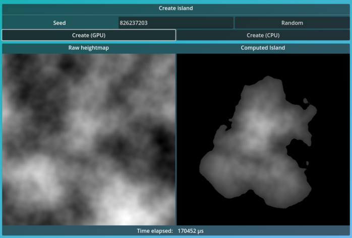

# Compute Shader

This demo project gives an example of how to use Compute Shaders in Godot. In this demo, we will generate the heightmap of an island from a noise texture, both on the CPU and the GPU.

For smaller noise textures, the CPU will often be faster, but the larger the gains are by using the GPU. On a PC with an RTX3060 and 11th gen intel i7 processor, the compute shader was tested to be faster for textures 1024 x 1024 squared and up.

Please note the shader code has been structured in such a way as to be followed step by step by the user, and may not necessarily represent best practices. Also note the CPU code is less optimized than it could be, in order to reflect the GPU code as much as possible. Besides the use of the GPU, no multithreading is used.

Languages: GDScript, GLSL

The dimensions of the image can be set on the exported "dimensions" variable on the main scene. Defaults to 2048.
